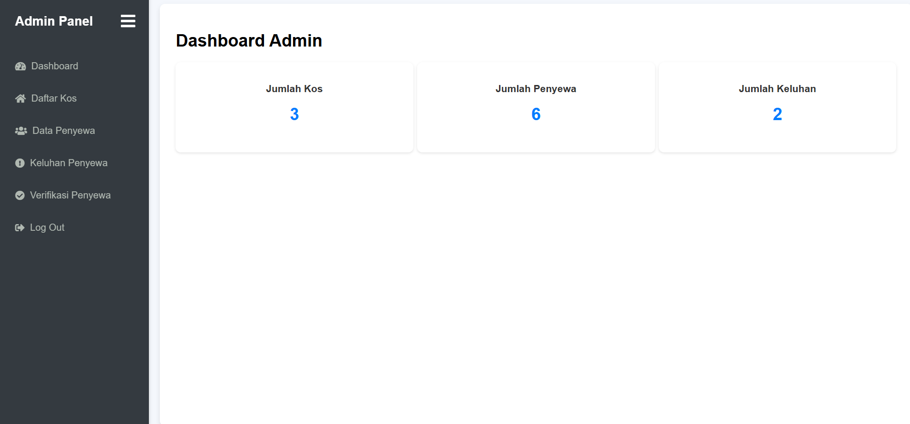
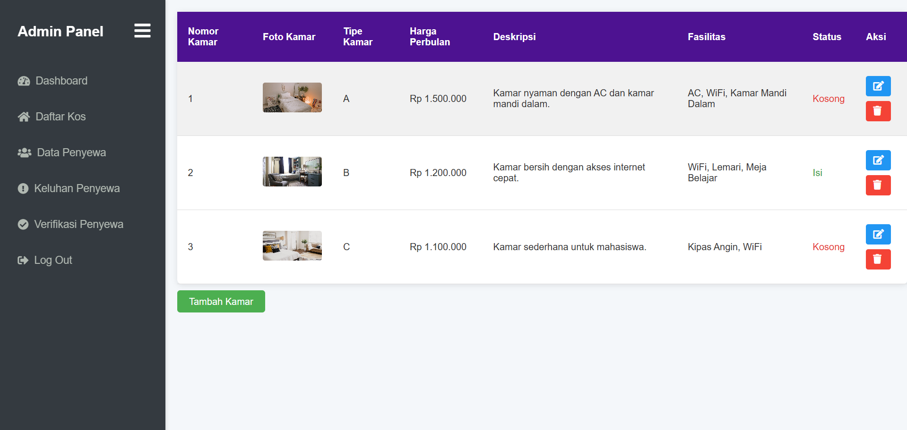

1. 27 April 2025
    - Buat Register
    - Buat Login
    - Buat index.php
    - Buat config database.php
    (Notes :    
    1. kedepannya bikin eror flash message di login/register)
    
    

2. 28 April 2025
    - Buat Dashboard Admin
    - Ngubah Routing / index.php
    (Notes :    
    1. buat style_admin.css karna biar css nya ga kepanjangan/jadi gaperlu capek scroll nantinya
    2. buat header_admin.php karna nntnya bakal beda menuju kaya css sama js dan kawan kawan
    3. sementara pake vanilla css dlu, untuk icon disini make font awesome
    4. itu hamburger/sidebar sementara gitu dlu aja kayanya, jd di layar gede jg defaultnya ketutup
    5. ngubah routing yg tadinya make if-else jadi switch-case karna biar enak aja jadi gaperlu ngecek kondisi 1 1)
    

3. 29 April 2025
    - Buat Daftar Kos di Admin
    - Buat Page Edit Kamar
    - Bikin file Sidebar (Tadinya cuma ada di Dashboard)
    (Notes :
    1. tombol tambah kamar belom berfungsi, lagi malas
    2. lupa apalagi)
    
    

4. 30 April 2025
    - Intinya Page Admin Sisa Verif Pengguna dah
    (Notes :
    1. Maap gada gambar, males ss
    2. Teks di status sewa kaya "Selesai" atau "Sewa" nantinya bakal di stylein
    3. Status pembayaran di history pembayaran juga)

5. 1 Mei 2025
    - Page verif kelar
    - Done styling di pembayaran, keluhan
    - Nambah kolom 'Status' di Feedback/keluhan
    (Notes :
    1. blm ada fitur kirim ke email saat verif
    2. blm responsive)